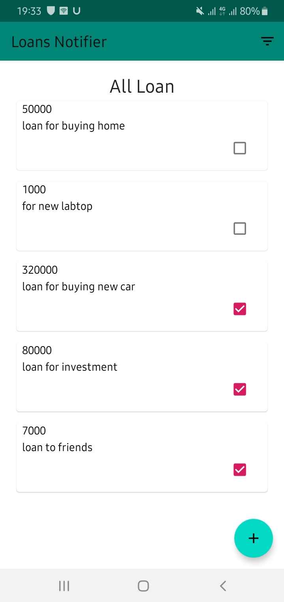
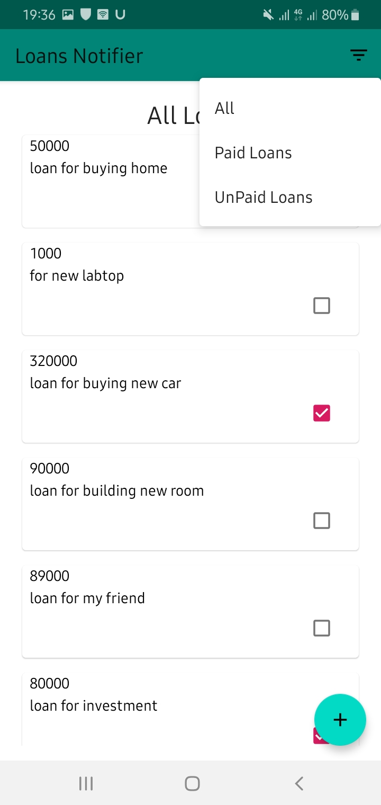
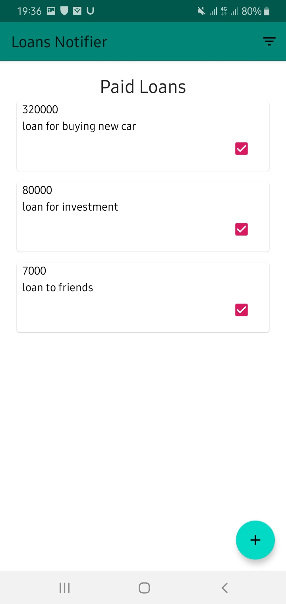

## Screenshots
     

## Built With 🛠
- [100% Kotlin](https://kotlinlang.org/)
- [Android Architecture Components](https://developer.android.com/topic/libraries/architecture)
  - [LiveData](https://developer.android.com/topic/libraries/architecture/livedata).
  - [ViewModel](https://developer.android.com/topic/libraries/architecture/viewmodel).
  - [Room](https://developer.android.com/topic/libraries/architecture/room).
- [Data Binding](https://developer.android.com/topic/libraries/data-binding)
- [Material Components for Android](https://github.com/material-components/material-components-android)
